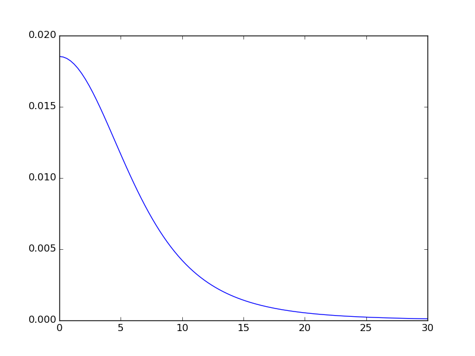
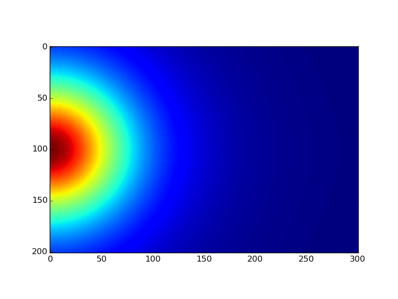
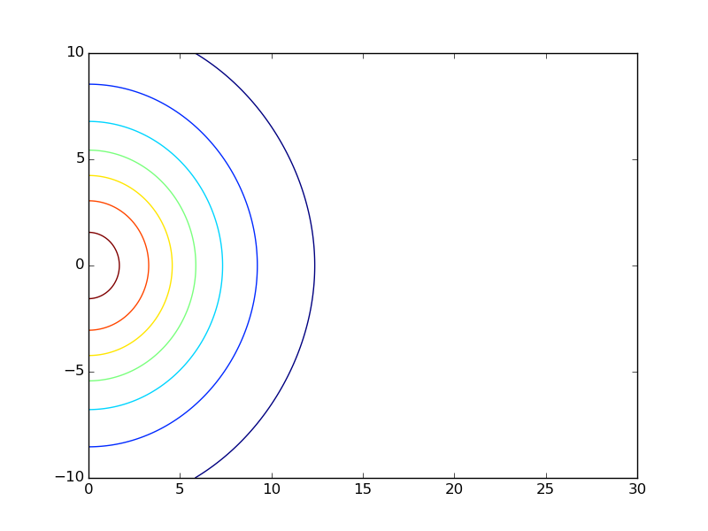
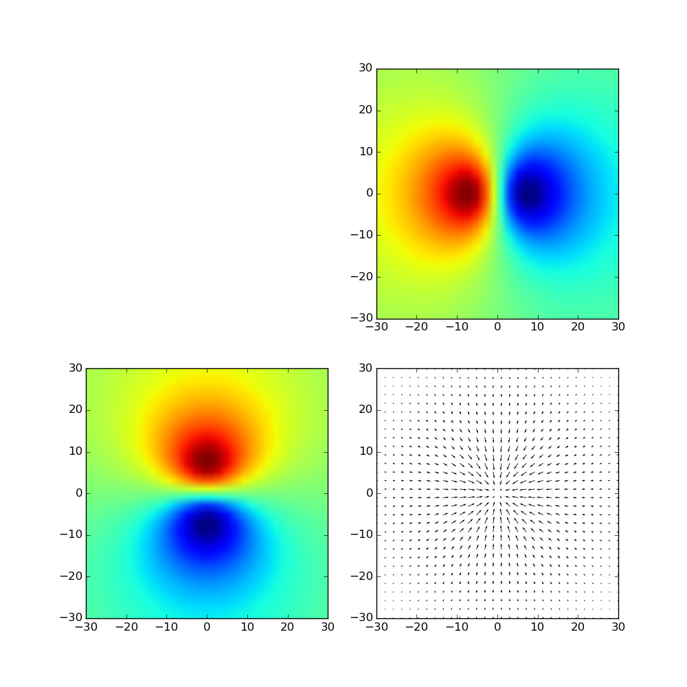
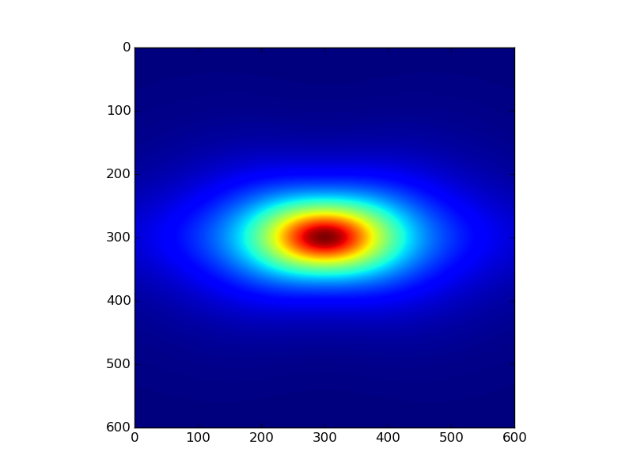
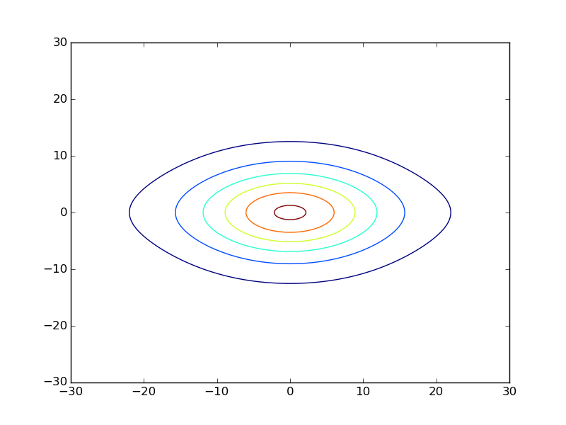
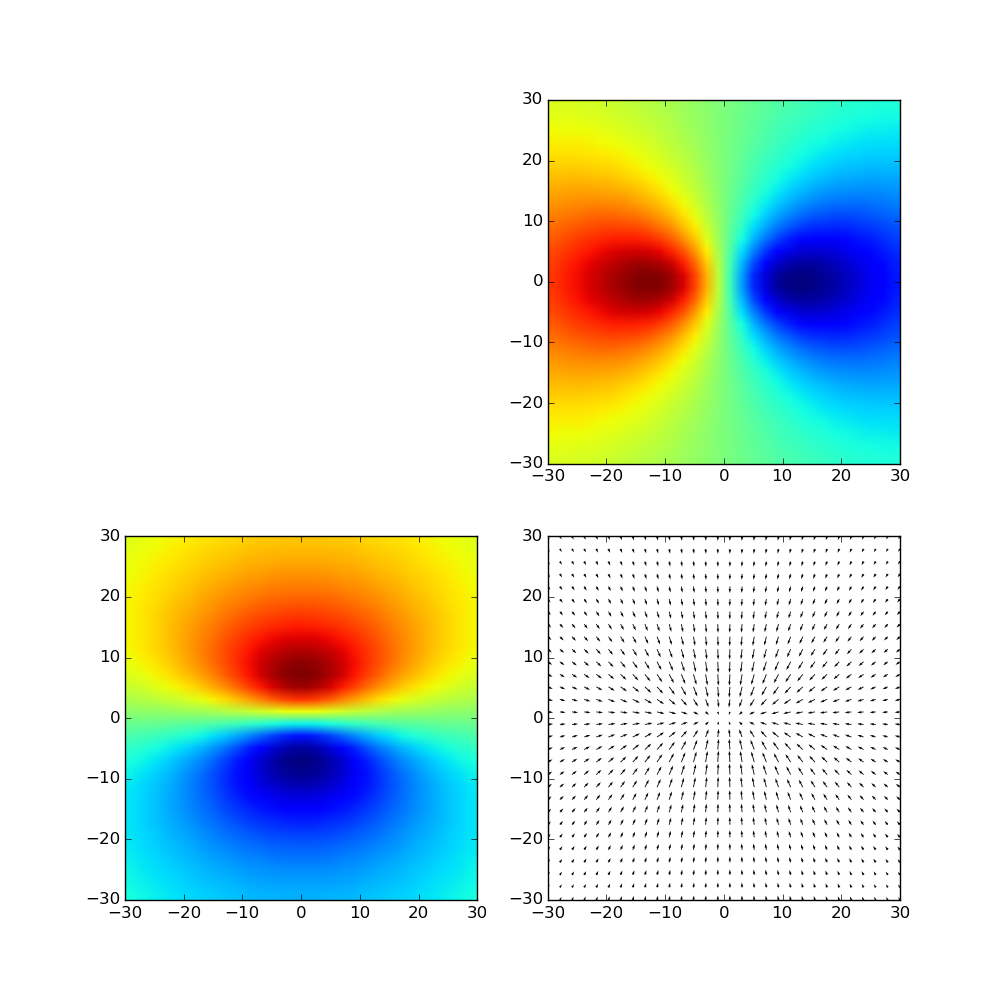
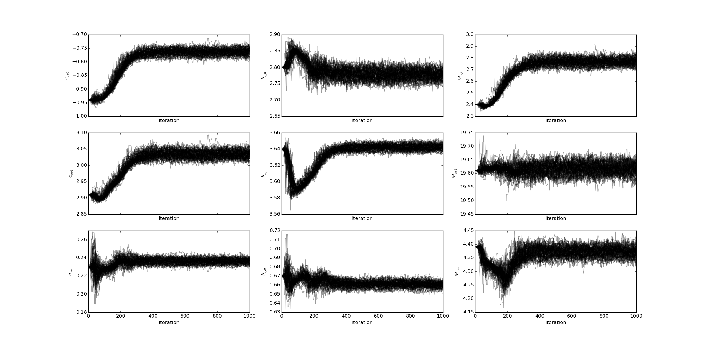
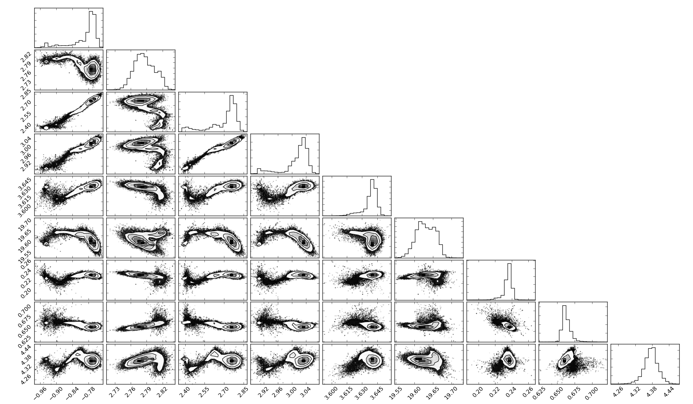

Tutorial
========

This tutorial will help you learn how to manipulate and use ``MNn`` to build models, fit them to data, and use them to retrieve potentials and densities.
The contents of this section are based on the examples you can find in the ``example`` folder of the code, or on the `repository <https://github.com/mdelorme/MNn/tree/master/mnn/examples>`_.

Simple model
------------

First and foremost, let's create a simple model with only one Miyamoto Nagai disc.
The disc will be aligned with the xy plane (thus the axis will be ``z``), and will have the following parameters : ``a=1.0``, ``b=10.0``, ``M=100.0``.

The first step is to import and instantiate the :class:`~mnn.model.MNnModel` class that represents our model :

>>> from mnn.model import MNnModel
>>> model = MNnModel()

Now we can add a Miyamoto-Nagai disc to the model :

>>> model.add_disc('z', 1.0, 10.0, 100.0)

The model is now ready to use. We can, for instance, retrieve the density, the potential or the force of the model at cartesian coordinates ``(1.0, 2.0, -0.5)`` :
    
>>> model.evaluate_potential(1.0, 2.0, -0.5)
-0.038273018555213874

>>> model.evaluate_density(1.0, 2.0, -0.5)
0.016676480491325717

>>> model.evaluate_force(1.0, 2.0, -0.5)
[-0.00030309 -0.00060619  0.00016668]

These methods can also be used with vectors. For instance, to evaluate the density along the x-axis, we can do :

>>> import numpy as np
>>> import matplotlib.pyplot as plt
>>> x = np.linspace(0.0, 30.0, 100.0)
>>> density = model.evaluate_density(x, 0.0, 0.0)
>>> plt.plot(x, density)
>>> plt.show()

You should obtain the following result :

  
We can also use the :func:`~mnn.model.MNnModel.evaluate_density_vec` method of :class:`~mnn.model.MNnModel` (and the ocrresponding methods for potential and force) to group the ``x``, ``y``, and ``z`` values in a single numpy array. For instance to evaluate potential over two points ``(1.0, 2.0, -0.5)`` and ``(-5.0, 0.0, 0.0)`` we can use :

>>> p = np.array(((2.0, 1.0, -0.5), (-5.0, 0.0, 0.0)))
>>> model.evaluate_potential_vec(p)
array([-0.03827302, -0.03559385])

Once the model is completed, you can generate a meshgrid of data. For instance, let's generate and plot a slice of the xz plane at ``y=0``, and for x in [0, 30] and z in [-10, 10]. To do this, we need to define a mesh size. We will make 300 cells along the x axis, 1 along the y axis and 200 along the z axis.

>>> x, y, z, v = model.generate_dataset_meshgrid((0.0, 0.0, -10.0), (30.0, 0.0, 10.0), (300, 1, 200))
>>> plt.imshow(v[0].T)
>>> plt.show()

Should give you :

.. note:: Please note that the scales on the image are wrong here because the values have been plotted without mention to the ``x`` and ``z`` tables.
	  This is mainly due for the tutorial briefness.

.. note:: By default, the :func:`~mnn.model.MNnModel.generate_dataset_meshgrid` method generates the density.
	  But you can ask it to generate the potential by using the keyword ``quantity='potential'`` or the force ``quantity='force'``
		    
	  
We can plot contour lines at the cost of a little more effort :

>>> # Selecting only the y=0 plane :
>>> x = np.linspace(0.0, 30.0, 300)
>>> z = np.linspace(-10.0, 10.0, 200)
>>> # And plotting the contour :
>>> plt.contour(x, z, v[0].T)
>>> plt.show()

These commands should give the following contour plot :

And with even more effort, we can plot a quiver plot of the force applied on the xy plane and the corresponding forces along each axis :

>>> # Generating the force mesh grid. The final image will be 30x30 to avoid having too many arrows on the quiver plot
>>> x, y, z, f = model.generate_dataset_meshgrid((-30.0, -30.0, 0.0), (30.0, 30.0, 0.0), (30, 30, 1), 'force')
>>> 
>>> # Selecting the z=0 plane and flattening the array
>>> x = x[:, :, 0].reshape(-1)
>>> y = y[:, :, 0].reshape(-1)
>>> 
>>> # Same thing but keeping the x and y components of the force
>>> fx = f[0, :, :, 0].reshape(-1)
>>> fy = f[1, :, :, 0].reshape(-1)
>>> 
>>> # Drawing the plot
>>> extent = [x.min(), x.max(), y.min(), y.max()]
>>> plt.figure(figsize=(10, 10))
>>> gs = gridspec.GridSpec(2, 2)
>>> ax1 = plt.subplot(gs[1, 0])
>>> pl1 = ax1.imshow(f[1, :, :, 0].T, extent=extent, aspect='auto')
>>> ax2 = plt.subplot(gs[0, 1])
>>> pl2 = ax2.imshow(f[0, :, :, 0].T, extent=extent, aspect='auto')
>>> ax3 = plt.subplot(gs[1, 1])
>>> pl3 = ax3.quiver(x.T, y.T, fx.T, fy.T, units='width', scale=0.045)
>>> plt.show()

The plot displayed should look like :

The quiver plot represents the x and y components of the force on the xy plane. The left plot shows only the y component of the force while the top plot shows the x component of the force. 

Multiple discs and negative scales
----------------------------------

The strength of ``MNn`` is to provide a model that sums multiple Miyamoto-Nagai discs, and that some of these models can have a negative disc scale (``a``). Let's create such a model with two discs. for this we can use the previous method :func:`~mnn.model.MNnModel.add_disc` or use a the wrapper :func:`~mnn.model.MNnModel.add_discs`. This wrapper takes a list of discs as we would create them with :func:`~mnn.model.MNnModel.add_disc`.

>>> model = MNnModel()
>>> discs = (('z', 20.0, 10.0, 100.0), ('y', -12.0, 20.0, 10.0))
>>> model.add_discs(discs)

.. note:: The discs can have ``a<0`` as long as ``a+b>=0``. The other constraints on the model are : ``b>=0`` and ``M>=0``.

This new model can be used as previously, for instance plotting the density on the ``x=0`` plane :

>>> x, y, z, v = model.generate_dataset_meshgrid((0.0, -20.0, -20.0), (0.0, 30.0, 30.0), (1, 600, 600))
>>> plt.imshow(v[:, 0].T)
>>> plt.show()

Will give you :

And :

>>> # Selecting the x=0 plane and flattening
>>> y = np.linspace(0.0, 30.0, 600)
>>> z = np.linspace(0.0, 30.0, 600)
>>> plt.contour(y, z, v[:, 0].T)
>>> plt.show()

Will yield :

Finally, doing the same as before and plotting the force on yz plane :

>>> x, y, z, f = model.generate_dataset_meshgrid((0.0, -30.0, -30.0), (0.0, 30.0, 30.0), (1, 30, 30), 'force')
>>> y = y[0].reshape(-1)
>>> z = z[0].reshape(-1)
>>> fy = f[1, 0].reshape(-1)
>>> fz = f[2, 0].reshape(-1)
>>> 
>>> extent = [y.min(), y.max(), z.min(), z.max()]
>>> plt.figure(figsize=(10, 10))
>>> gs = gridspec.GridSpec(2, 2)
>>> ax1 = plt.subplot(gs[1, 0])
>>> pl1 = ax1.imshow(f[2, 0].T, extent=extent, aspect='auto')
>>> ax2 = plt.subplot(gs[0, 1])
>>> pl2 = ax2.imshow(f[1, 0].T, extent=extent, aspect='auto')
>>> ax3 = plt.subplot(gs[1, 1])
>>> pl3 = ax3.quiver(y.T, z.T, fy.T, fz.T, units='width')
>>> plt.show()	   

Will give the following plot :

Fitting Data
------------

Until now, we have seen how to build a model from scratch and how to use it to produce densities or potential
values at specific points using :class:`~mnn.model.MNnModel`. It might be complicated to guess automatically
the parameters of the discs. That's where the second class of ``MNn`` comes into play : :class:`~mnn.fitter.MNnFitter`.
:class:`~mnn.fitter.MNnFitter` relies on `emcee  <http://dan.iel.fm/emcee/current/>`_ to fit the model to datasets. 

In this example, we are going to fit an exponential disc to a MNn model. The dataset we are using is in the folder
``examples`` under the name ``density.dat``. First we need to create the fitter object :

>>> from mnn.fitter import MNnFitter
>>> fitter = MNnFitter(fit_type='density', n_threads=1, n_walkers=100, n_steps=1000, verbose=True)

With this line, we indicate the data we want to fit our model on is a density file. We only use one thread in this example but
since ``emcee`` is multithreaded, it is possible to set here the number of threads you want to use for the fitting.

Then we define the MCMC parameters : the number of walkers and the number of steps. We start with 100 walkers and 1000 steps to get
the solution. Sinally we ask the program to give us as much information as it can.

Since we are using a Monte-Carlo method, it is always better to have a first idea of the location of the solution.
In this case, for the sake of tutorial, we will give a pretty close estimate of the solution as initial guess so we don't
spend too much time fiddling with the sampler. Of course in *real life situations* you will have to try different solving methods to
find the good ratio of walkers, iterations, models and initial guess to converge correctly on a adequate solution. But for the moment
let's learn how to play with the fitter. 

Now we need to load the data in the fitter :

>>> fitter.load_data('density.dat')

.. note:: The data file format must be ascii, with four columns : x y z and the value (here the density). The columns can be space or tab
   separated.

We have our data, we have the MCMC sampler, we only need to define the form of the model we want to fit. Here, we will use a model with
three discs aligned on the xy plane. The normal axis is thus ``z`` :

>>> fitter.set_model_type(0, 0, 3)

We have an idea of an initial guess so we can store it in a vector :

>>> initial_guess = np.array((-0.94, 2.80, 2.40, 2.91, 3.64, 19.61, 0.23, 0.67, 4.39))

The list is what we call a flattened model. The first three values will be the parameters of the first disc, the next three the
second disc and so on. The order for the normal axis is : first all the discs on the x-axis, then all the y-axis and finally all
the z-axis. For instance, if our model was (2, 3, 1), the six first parameters would correspond to two discs on the yz plane,
the next nine parameters would be for discs on the xz plane, and finally the last three for a disc on the xy plane.

We can now run the fitter to get an estimate of our parameters :

>>> samples, prob = fitter.fit_data(burnin=400, plot_freq=50, x0=initial_guess)

Here, we indicate that we want to get rid of the 400 first timesteps. Now the 600 timesteps lefts for every walker will be converted in a solution stored in samples. So samples will be a numpy array of dimension 600*100 solutions. Every solution is 9 parameters.
Going with the array of solutions, the log likelihood of each solution is given in the prob array.

Once the fitter has finished, we can plot the whole chain to see the results :

>>> fitter.plot_disc_walkers()
>>> plt.show()

.. note:: The method :func:`~mnn.fitter.MNnFitter.plot_disc_walkers` returns a matplotlib figure object. You can save it using
   the ``savefig`` method of this object.

You should get a result looking like this :

	  

Now the program seems to have converged on a solution. An acceptable solution is the median of the values. What we can do, since
all the walkers have converged on the same solution and there is no degeneracy is to compute quantiles on the solution, and
keep the median solution plus or minus one standard deviation.

>>> q = fitter.compute_quantiles(samples)

.. note:: By default, the :func:`~mnn.fitter.MNnFitter.compute_quantiles` method gives the percentiles at 16, 50 and 84 percents. You
   can change this by passing a list to the function as the named parameter ``quantiles``. For instance, if we wanted the quartiles
   we would call the function as follows : ``fitter.compute_quantiles(samples, quantiles=(25, 50, 75))``

The vector ``q`` holds the quantiles for every parameter of the flattened model. So ``q[0]`` will be the 16% percentile for all
parameters, ``q[1]`` the median and ``q[2]`` the 84% percentile. Let's store the median value in a model and use it :

>>> model = fitter.make_model(q[1])
>>> model.get_model()
[('z', -0.764662259246505, 2.778760853324447, 2.7663901965387043),
 ('z', 3.0334881497301636, 3.6413315596626976, 19.619246932879513),
 ('z', 0.23673507131588803, 0.6608545874695207, 4.373688142450103)]

Now, you have an instance of :class:`mnn.model.MNnModel` that you can use as we have seen in the first two sections of this tutorial !

Additional features
-------------------

Corner plots
^^^^^^^^^^^^
If you are interested on displaying the corner plots proposed in ``emcee`` you can use the :func:`~mnn.fitter.MNnFitter.corner_plot` method :

>>> fitter.corner_plot(q[1])

Calling this method on the previous example gives us the following plot :

Residuals
^^^^^^^^^	   

The fitter offers the possibility to compute the residuals between a flattened model and your data. To do this, use the method
:func:`~mnn.fitter.MNnFitter.get_residuals`

>>> fitter.get_residuals(q[1])

These residuals are returned as a numpy array. So you can use ``np.linalg.norm()`` to compute the error on the solution.

This concludes this tutorial. Feel free to browse the :doc:`API </reference>` to find more information and ask your question on the
`github repository <https://github.com/mdelorme/MNn/>`_.
	  
